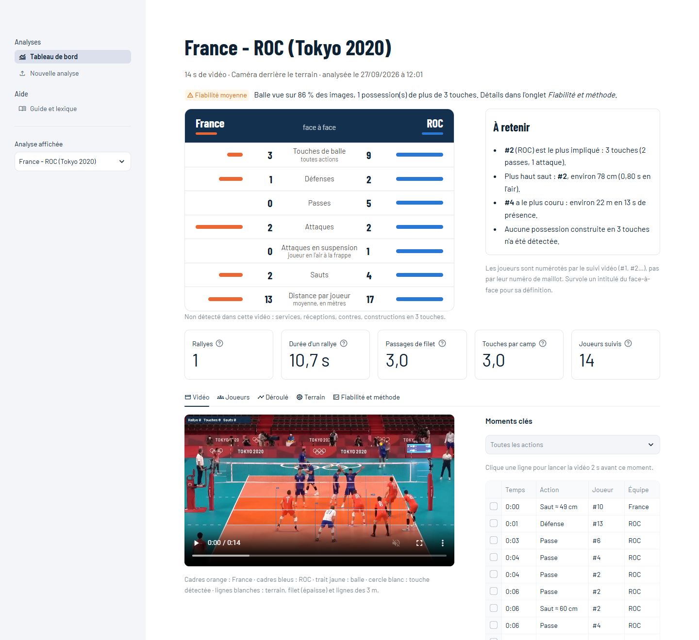

# Volley Analytics

Analyse automatique de matchs de volley filmés en caméra fixe : on importe la vidéo, on repère le terrain,
et l'outil suit les joueurs et la balle, détecte les touches, en déduit les actions (service, réception,
passe, attaque, contre), mesure sauts et déplacements, puis présente le tout dans un tableau de bord.



## Fonctionnalités

- **Page d'import** : fichier, lien YouTube ou vidéo déjà sur le disque, choix de la portion à analyser,
  repérage du terrain détecté automatiquement puis corrigeable au clic, analyse en arrière-plan avec progression.
- **Tableau de bord** : face-à-face des deux équipes, points clés, vidéo annotée pilotable depuis la liste
  des actions, fiche par joueur, chronologie des rallyes, cartes d'occupation du terrain et des touches.
- **Fiabilité expliquée** : chaque analyse affiche son niveau de confiance et pourquoi (balle détectée,
  contacts sans joueur, possessions suspectes), avec un guide et un lexique de chaque statistique.

## Méthode

- **Joueurs** : YOLO26m-pose + BoT-SORT (Ultralytics). Les pistes qui changent de camp (échange d'identité
  au filet) sont coupées, les morceaux d'un même joueur recollés, arbitres et juges de ligne écartés.
- **Terrain** : homographie à partir des 4 coins (9 × 18 m) ; positions en mètres, vrai filet même en
  perspective, vue de fond ou de côté. Les coins sont proposés par le modèle de segmentation VolleyVision.
- **Balle** : YOLOv8 entraîné sur une balle de volley (VolleyVision).
- **Touches** : cassure de trajectoire près des mains d'un joueur ; au filet, attribution par Viterbi en
  respectant les règles (3 touches par camp, pas deux de suite pour un même joueur).
- **Actions** : déduites de l'ordre des touches dans chaque possession ; contre = touche au filet juste après
  l'adversaire.
- **Sauts** : montée des chevilles, hauteur estimée par le temps de vol. **Distances** : positions au sol lissées.
- **Interface** : Streamlit + Altair.

## Installation (Windows, GPU AMD RDNA4)

```
py -3.12 -m venv .venv
.\.venv\Scripts\Activate.ps1
pip install --index-url https://rocm.nightlies.amd.com/v2/gfx120X-all/ --pre torch torchvision
pip install -r requirements.txt
```

Sur GPU NVIDIA ou CPU, installer torch depuis pytorch.org à la place. `ffmpeg` dans le PATH est recommandé
(découpage et vidéo annotée lisible dans le navigateur). Les modèles balle et terrain viennent du dépôt
[VolleyVision](https://github.com/Shaamallow/VolleyVision), à cloner dans `VolleyVision/`.

## Utilisation

```
python -m streamlit run app.py
```

Puis *Nouvelle analyse* : importer la vidéo, vérifier le repère du terrain, lancer.

En ligne de commande :

```
python analyze.py match.mp4 --start 60 --end 180 --title "Match du samedi"
python analyze.py match.mp4 --reuse             # recalcul sans GPU après modification des seuils
python analyze.py match.mp4 --reuse --reclick   # recliquer les coins du terrain
```

Les seuils sont dans `CFG` en haut de `analyze.py` ; `--reuse` réanalyse en quelques secondes.
Chaque analyse est rangée dans `results/<nom>/` (`results.json`, `annotated.mp4`, `raw.json`…).

## Limites

- Les joueurs sont identifiés par le suivi (#1, #2…), pas encore par leur numéro de maillot.
- Au filet, attaquant et contreur se superposent à l'image : c'est là que l'attribution est la plus fragile.
- Les seuils de touche sont en pixels : une balle loin de la caméra (service adverse) peut passer inaperçue.
- Le gagnant de chaque rallye n'est pas encore détecté.
- La hauteur de saut est un ordre de grandeur.

## Licence

AGPL-3.0, pour rester compatible avec Ultralytics.
